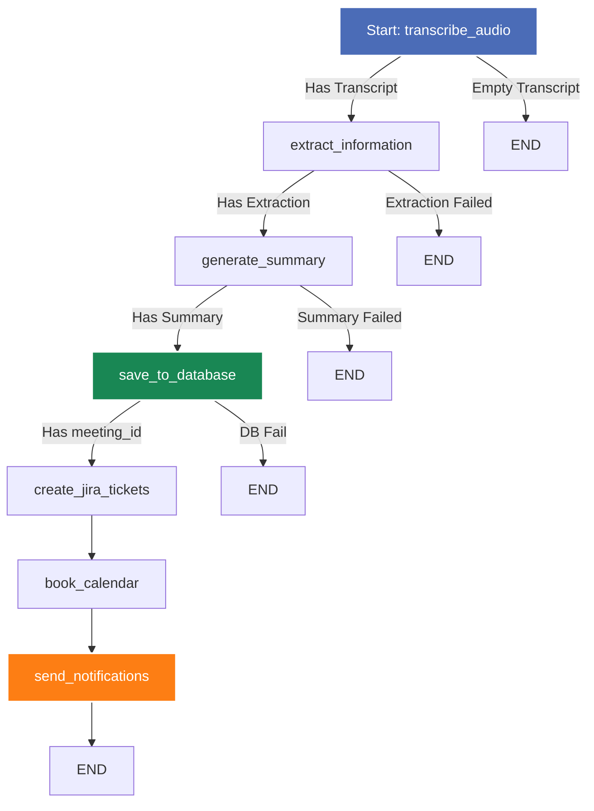

# Meeting Intelligence Agent - Backend Developer Guide

This directory houses the backend codebase for the **Meeting Intelligence Agent**, a FastAPI-powered service integrated with LangGraph for processing meeting audio recordings. It transcribes audio, extracts structured intelligence (action items, decisions, participants, and topics), persists data to Neon Postgres, and dispatches results to third-party integrations (Jira, Google Calendar, Slack, and SendGrid).

---

## Table of Contents

1. [Architecture & Design Concepts](#architecture--design-concepts)
2. [LangGraph Agentic Pipeline](#langgraph-agentic-pipeline)
3. [Database Schema & ORM Model](#database-schema--orm-model)
4. [Third-Party Integrations](#third-party-integrations)
5. [FastAPI Web Layer & Routes](#fastapi-web-layer--routes)
6. [Configuration & Environment Setup](#configuration--environment-setup)
7. [Local Development & Setup](#local-development--setup)
8. [Code Structure](#code-structure)

---

## Architecture & Design Concepts

The backend is built as a modular, production-ready asynchronous Python application using **FastAPI** for HTTP routing, **SQLAlchemy** for database connectivity, and **LangGraph** to coordinate multi-agent processes.

### Key Concepts

*   **Stateful Agent Pipelines**: Instead of monolithic scripts, processing is designed as a directed state graph. Shared state flows through specialized nodes, ensuring clear separation of concerns, easy error recovery, and modular testing.
*   **Asynchronous I/O**: The API endpoints utilize FastAPI's asynchronous support (`async/await`) for database operations, network routing, and streaming files. 
*   **Thread Pools for Synchronous Blocks**: Heavy synchronous libraries (e.g., Jira SDK, Google API clients, LangGraph graph execution) are run in background threads using `asyncio.to_thread` or standard background tasks to avoid blocking FastAPI's main event loop.
*   **Structured Logging**: Configured via `structlog` to output clean, colorized logs in development and structured JSON outputs in production for parsing by log aggregators.
*   **API Resilience**: Outbound LLM and integration requests are protected with exponential backoff and automatic retry policies via the `tenacity` library.

---

## LangGraph Agentic Pipeline

The meeting processing flow is modeled as a state machine using `langgraph.graph.StateGraph`. The state container `AgentState` maps to Pydantic validation schemas.



### Pipeline Node Overview

| Node | Name | LLM / Service | Description | Output |
|---|---|---|---|---|
| **Node 1** | `transcribe_audio` | Groq `whisper-large-v3` | Validates file, uploads to Whisper API, and returns transcript. | `transcript` |
| **Node 2** | `extract_information` | Groq `llama-3.3-70b` | Uses JSON mode to parse action items, decisions, participants, and topics. | `extraction` |
| **Node 3** | `generate_summary` | Groq `llama-3.3-70b` | Creates structured title, duration, short summary, and detailed summary. | `summary` |
| **Node 4** | `save_to_database` | SQLAlchemy + Neon Postgres | Persists the meeting and its related models in a single database transaction. | `meeting_id` |
| **Node 5** | `create_jira_tickets` | Atlassian Jira SDK | Creates a Jira task per action item. Uses Atlassian Document Format (ADF) for description. | `jira_ticket_ids` |
| **Node 6** | `book_calendar` | Google Calendar API | Books a 1-hour follow-up event 7 days in the future via a Service Account. | `calendar_event_id` |
| **Node 7** | `send_notifications` | Slack Webhook + SendGrid | Sends Slack summary cards & personalized emails containing only that recipient's action items. | `notification_results` |

---

## Database Schema & ORM Model

The database is built on **Neon Serverless Postgres** utilizing `pgvector` for future semantic search and RAG indexing. 

```
  ┌─────────────────────────────────────────────────────────────┐
  │                           meetings                          │
  ├─────────────────────────────────────────────────────────────┤
  │ id (PK) | title | audio_filename | duration_minutes |       │
  │ short_summary | detailed_summary | embedding_status |      │
  │ transcript_embedding (pgvector 768) | created_at            │
  └──────────────────────────────┬──────────────────────────────┘
                                 │
         ┌───────────────────────┼──────────────────────────────┐
         ▼                       ▼                              ▼
 ┌───────────────┐       ┌───────────────┐              ┌───────────────┐
 │ action_items  │       │   decisions   │              │ participants  │
 ├───────────────┤       ├───────────────┤              ├───────────────┤
 │ id (PK)       │       │ id (PK)       │              │ id (PK)       │
 │ meeting_id(FK)│       │ meeting_id(FK)│              │ meeting_id(FK)│
 │ description   │       │ description   │              │ name          │
 │ owner         │       │ context       │              │ email (Opt)   │
 │ due_date      │       │ created_at    │              │ created_at    │
 │ priority      │       └───────────────┘              └───────────────┘
 │ jira_ticket_id│
 │ status        │
 │ created_at    │
 └───────────────┘
```

*   **Cascade Deletes**: All relationships (`action_items`, `decisions`, `participants`, `notifications_log`) have Cascade Deletes set in the SQLAlchemy models. Deleting a meeting row deletes all child rows.
*   **Asyncpg Connector**: Neon async connections require translation of `sslmode=require` query parameters to `ssl=require`. This is dynamically handled in [database.py](file:///c:/Agentic%20AI%20Project/Backend/db/database.py).

---

## Third-Party Integrations

### 1. Jira Ticket Creation ([jira_tool.py](file:///c:/Agentic%20AI%20Project/Backend/tools/jira_tool.py))
*   Converts priority values (`low`, `medium`, `high`) to standard Jira priority strings (`Low`, `Medium`, `High`).
*   Builds rich descriptions compliant with Jira Cloud's **Atlassian Document Format (ADF)** structure using JSON to avoid formatting errors on Jira Cloud.

### 2. Google Calendar Event Booking ([calender_tool.py](file:///c:/Agentic%20AI%20Project/Backend/tools/calender_tool.py))
*   Connects using Google Cloud Service Account credentials loaded via `GOOGLE_CALENDAR_CREDENTIALS_JSON`.
*   Invites participants by matching their email addresses. Sets `sendUpdates="all"` to automatically trigger email notifications from Google's server.

### 3. Slack Summary Broadcast ([slack_tool.py](file:///c:/Agentic%20AI%20Project/Backend/tools/slack_tool.py))
*   Constructs a highly readable summary layout via **Slack Block Kit** (includes Headers, Dividers, Context, and Markdown blocks).
*   Broadcasts to a specified Slack channel via an Incoming Webhook.

### 4. Personalized Transactional Emails ([email_tool.py](file:///c:/Agentic%20AI%20Project/Backend/tools/email_tool.py))
*   Uses **SendGrid API** to bypass Gmail sending rate-limits and filter blocks.
*   **Personalization Engine**: Emails are customized for each individual participant. Alice receives a list of only *her* action items, while Bob receives a list of only *his* action items, ensuring clarity and confidentiality.

---

## FastAPI Web Layer & Routes

The API is fully declared in [api/routes.py](file:///c:/Agentic%20AI%20Project/Backend/api/routes.py).

### Endpoint Index

*   `GET /health`: System checks & Neon Postgres availability verification.
*   `POST /meeting/upload`: Accepts `multipart/form-data`. Streams incoming audio file to the configured uploads folder to restrict RAM consumption.
*   `POST /meetings/process`: Triggers the async execution of the LangGraph agent graph on the background thread pool.
*   `GET /meetings/status/{job_id}`: Retrieves execution progress and timings for each node.
*   `GET /meetings`: Paginated list of processed meetings.
*   `GET /meetings/{meeting_id}`: Full detail response, including action items, decisions, and integration status logs.
*   `PATCH /meetings/{meeting_id}/action-items/{item_id}`: Updates a task status (`open`, `in_progress`, `done`).
*   `PATCH /meetings/{meeting_id}/participants/{participant_id}`: Saves participant emails.
*   `POST /meetings/{meeting_id}/send/(email|slack|jira|calendar)`: Triggers manual retries/dispatch of integrations.
*   `POST /query`: Semantic/rule-based conversational agent interface. Directs inquiries about participants, decisions, action items, or summaries.

---

## Configuration & Environment Setup

Settings are managed via a typed `BaseSettings` object in [core/config.py](file:///c:/Agentic%20AI%20Project/Backend/core/config.py) loading from `Backend/.env`.

### Environment Variables

```bash
# General
APP_ENV=development                   # development | production
SECRET_KEY=generate-a-long-random-string

# LLM Providers (Required)
GROQ_API_KEY=gsk_...

# Database (Required)
DATABASE_URL=postgresql+asyncpg://... # Neon Async URL
DATABASE_URL_SYNC=postgresql+psycopg2://... # Sync connection for migrations

# Slack Integration (Optional)
SLACK_WEBHOOK_URL=https://hooks.slack.com/services/...
SLACK_CHANNEL=#meeting-summaries

# SendGrid (Optional)
SENDGRID_API_KEY=SG....
SENDER_EMAIL=agent@yourdomain.com
SENDER_NAME="Meeting Intelligence Agent"

# Jira Integration (Optional)
JIRA_URL=https://yourcompany.atlassian.net
JIRA_EMAIL=dev@yourcompany.com
JIRA_API_TOKEN=jira_token_here
JIRA_PROJECT_KEY=PROJ

# Google Calendar (Optional)
GOOGLE_CALENDAR_CREDENTIALS_JSON='{"type": "service_account", ...}'
GOOGLE_CALENDAR_ID=primary

# Upload Limits
MAX_UPLOAD_SIZE_MB=1024
UPLOAD_DIR=/tmp/meeting-agent-uploads
```

---

## Local Development & Setup

### Prerequisite: System Pathing
Ensure that Python 3.10+ is installed and configured on your path.

1.  **Clone the Repo and Initialize Virtual Environment**:
    ```bash
    cd Backend
    python -m venv venv
    
    # Windows
    .\venv\Scripts\activate
    # macOS/Linux
    source venv/bin/activate
    ```

2.  **Install Dependencies**:
    ```bash
    pip install -r requirements.txt
    ```

3.  **Run Development Server**:
    ```bash
    uvicorn api.main:app --reload --host 0.0.0.0 --port 8000
    ```
    *   API Docs will be served at: `http://localhost:8000/docs`
    *   ReDoc documentation will be served at: `http://localhost:8000/redoc`

4.  **Run Automated Tests**:
    ```bash
    pytest
    ```

---

## Code Structure

```
Backend/
├── agents/              # LangGraph Agents
│   ├── transcription.py # Node 1: Whisper Audio Ingestion
│   ├── extraction.py    # Node 2: Entity & Information Extraction
│   └── summary.py       # Node 3: Structured Meeting Summarization
├── api/                 # FastAPI Router & App definition
│   ├── main.py          # CORS, GZip, Exceptions, Lifespan entry point
│   └── routes.py        # Request validation, Background Tasks, Upload stream
├── core/                # System Configuration & Config loaders
│   ├── config.py        # Settings validation (Pydantic Settings)
│   └── logging.py       # Structlog initialization
├── db/                  # Persistence Layer
│   ├── database.py      # SQLAlchemy engine configuration & Node 4 helper
│   └── models.py        # Declarative ORM entities (pgvector representation)
├── graph/               # LangGraph Engine
│   └── agent_graph.py   # StateGraph flow definitions, routing logic
├── models/              # Schema layer
│   └── schemas.py       # Pydantic state container, API request & response shapes
├── tools/               # Integration Modules
│   ├── calender_tool.py # Node 6: Google Calendar booking
│   ├── email_tool.py    # Node 7a: Personalized SendGrid dispatches
│   ├── jira_tool.py     # Node 5: Jira Issue creation (ADF structured)
│   └── slack_tool.py    # Node 7b: Slack Block Kit Webhook alerts
├── requirements.txt     # Python Dependencies
└── .env                 # Environment Settings (Git-ignored)
```
