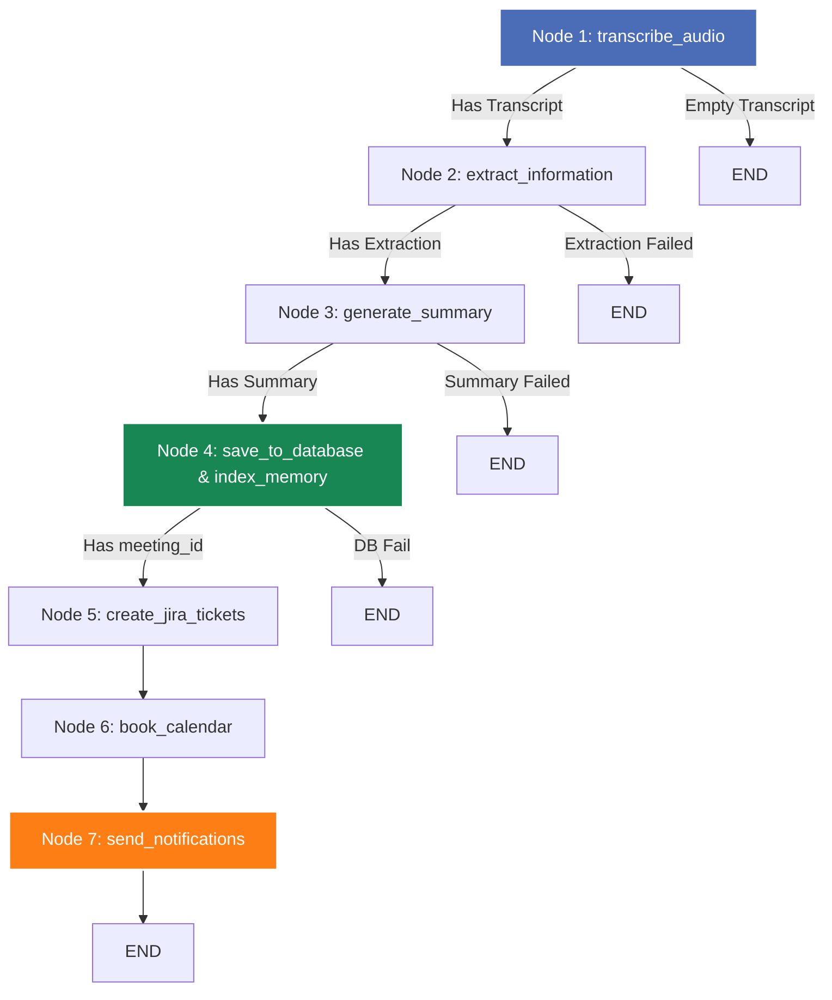

# Meeting Intelligence Agent - Backend Developer Guide

This directory houses the backend service for the **Meeting Intelligence Agent**, a FastAPI-powered application integrated with LangGraph for processing meeting audio recordings. It transcribes audio, performs speaker diarization, extracts structured intelligence (action items, decisions, participants, topics), indexes meetings into a cross-meeting vector memory RAG layer (`pgvector`), dynamically routes requests across Groq LLMs, persists data to Neon Postgres, and dispatches results to third-party integrations (Jira, Google Calendar, Slack, SendGrid).

---

## Table of Contents

1. [Architecture & Design Concepts](#architecture--design-concepts)
2. [LangGraph Agentic Pipeline](#langgraph-agentic-pipeline)
3. [Multi-LLM Routing Engine](#multi-llm-routing-engine)
4. [Cross-Meeting Vector Memory (RAG)](#cross-meeting-vector-memory-rag)
5. [Speaker Diarization & Audio Chunking](#speaker-diarization--audio-chunking)
6. [Database Schema & Job Persistence](#database-schema--job-persistence)
7. [Third-Party Integrations](#third-party-integrations)
8. [FastAPI Web Layer & Endpoints](#fastapi-web-layer--endpoints)
9. [Configuration & Environment Setup](#configuration--environment-setup)
10. [Testing & Verification](#testing--verification)
11. [Code Structure](#code-structure)

---

## Architecture & Design Concepts

The backend is engineered as an asynchronous Python service utilizing **FastAPI** for HTTP/SSE routing, **SQLAlchemy v2** for database interaction, and **LangGraph** for multi-agent process orchestration.

### Key Architectural Patterns

*   **Stateful Agent Graph**: Processing is modeled as a directed state machine (`AgentState`), decoupling execution nodes, isolating failure modes, and enabling granular status reporting.
*   **Asynchronous I/O**: Endpoints leverage FastAPI's `async/await` paradigm for non-blocking network operations, file streaming, and database queries.
*   **Worker Thread Offloading**: Blocking operations (PyAnnote model execution, FFmpeg subprocesses, third-party SDK calls, synchronous LangGraph runs) execute in worker threads via `asyncio.to_thread`.
*   **Persistent Job Queue Tracking**: Background processing status, node completion arrays, error stacks, and timing statistics are written to PostgreSQL (`processing_jobs`), surviving server restarts.
*   **API Resilience**: Outbound LLM and service requests feature automated retry policies with exponential backoff powered by `tenacity`.

---

## LangGraph Agentic Pipeline

The core meeting pipeline is configured using `langgraph.graph.StateGraph`.



### Pipeline Node Specifications

| Node | Function | Model / Engine | Output Artifacts |
|---|---|---|---|
| **Node 1** | `transcribe_audio` | Groq `whisper-large-v3` + PyAnnote 3.1 + FFmpeg | `transcript`, `diarized_transcript`, `speaker_segments` |
| **Node 2** | `extract_information` | Dynamic Groq Router (`8b-instant` or `70b-versatile`) | `extraction` (action items, decisions, participants, topics) |
| **Node 3** | `generate_summary` | Groq `llama-3.1-8b-instant` | `summary` (title, duration, short summary, detailed narrative) |
| **Node 4** | `save_to_database` | SQLAlchemy + Neon Postgres + `MemoryService` | `meeting_id`, `pgvector` embedding (`transcript_embedding`) |
| **Node 5** | `create_jira_tickets` | Atlassian Jira Python SDK | `jira_ticket_ids` |
| **Node 6** | `book_calendar` | Google Calendar API v3 | `calendar_event_id` |
| **Node 7** | `send_notifications` | SendGrid API + Slack Webhooks | `notification_results` |

---

## Multi-LLM Routing Engine

Located in [`core/llm_router.py`](file:///c:/Agentic%20AI%20Project/Backend/core/llm_router.py), the `LLMRouter` dynamically selects the appropriate Groq LLM per task:

| Task Type | Condition | Selected Model | Rationale |
|---|---|---|---|
| **Extraction** | Transcript < 3,000 words | `llama-3.1-8b-instant` | Fast, low latency for standard recordings |
| **Extraction** | Transcript ≥ 3,000 words | `llama-3.3-70b-versatile` | High reasoning capacity for dense long-form content |
| **Summary** | Always | `llama-3.1-8b-instant` | Operates on compact pre-extracted JSON structures |
| **Q&A (`/query`)** | Simple keyword lookup | `llama-3.1-8b-instant` | Rapid response for simple participant or task questions |
| **Q&A (`/query`)** | Complex / long context | `llama-3.3-70b-versatile` | Deep context synthesis and cross-meeting analytical Q&A |

Thresholds can be customized via `.env`:
```env
LLM_FAST_MODEL=llama-3.1-8b-instant
LLM_POWERFUL_MODEL=llama-3.3-70b-versatile
LLM_ROUTING_WORD_THRESHOLD=3000
```

---

## Cross-Meeting Vector Memory (RAG)

Located in [`core/memory_service.py`](file:///c:/Agentic%20AI%20Project/Backend/core/memory_service.py), `MemoryService` provides semantic search across historical meetings:

1. **Embedding Generation**: Produces 768-dimensional normalized dense feature vectors combining meeting title, short summary, detailed narrative, and speaker transcripts.
2. **Vector Persistence**: Saved into Neon Postgres `pgvector` (`meetings.transcript_embedding`).
3. **Semantic Retrieval**: Used by `/memory/search` and injected into `/query` and `/query/stream` prompts for cross-meeting context retrieval (e.g. *"What did we decide about budget in previous meetings?"*).

---

## Speaker Diarization & Audio Chunking

### 1. Automatic Audio Chunking (FFmpeg)
Groq Whisper API imposes a 25MB request ceiling. Node 1 detects files exceeding 25MB and:
1. Calls FFmpeg with stream copy (`-c copy`) to segment audio into 10-minute chunks without quality loss.
2. Transcribes chunks independently via Groq Whisper API.
3. Applies time offset adjustments (`i * 600s`) before joining segment transcripts.

### 2. Speaker Diarization (PyAnnote 3.1)
When `HF_TOKEN` is configured:
1. Runs `pyannote/speaker-diarization-3.1` to extract speaker intervals (`SPEAKER_00`, `SPEAKER_01`).
2. Requests Groq Whisper in `verbose_json` mode to obtain word-level timestamps.
3. Maps speaker intervals onto transcript segments to generate `diarized_transcript`.
4. If `HF_TOKEN` is missing or pyannote is not installed, gracefully falls back to standard text.

---

## Database Schema & Job Persistence

```
  ┌─────────────────────────────────────────────────────────────┐
  │                           meetings                          │
  ├─────────────────────────────────────────────────────────────┤
  │ id (PK) | title | audio_filename | duration_minutes |       │
  │ short_summary | detailed_summary | transcript |             │
  │ diarized_transcript | transcript_embedding (pgvector 768)   │
  │ embedding_status | created_at                               │
  └──────────────────────────────┬──────────────────────────────┘
                                 │
         ┌───────────────────────┼──────────────────────────────┬──────────────────────────────┐
         ▼                       ▼                              ▼                              ▼
  ┌───────────────┐       ┌───────────────┐              ┌───────────────┐              ┌───────────────┐
  │ action_items  │       │   decisions   │              │ participants  │              │processing_jobs│
  ├───────────────┤       ├───────────────┤              ├───────────────┤              ├───────────────┤
  │ id (PK)       │       │ id (PK)       │              │ id (PK)       │              │ id (PK)       │
  │ meeting_id(FK)│       │ meeting_id(FK)│              │ meeting_id(FK)│              │ status        │
  │ description   │       │ description   │              │ name          │              │ meeting_id    │
  │ owner         │       │ context       │              │ email (Opt)   │              │ completed_node│
  │ due_date      │       │ created_at    │              │ created_at    │              │ node_timings  │
  │ priority      │       └───────────────┘              └───────────────┘              │ started_at    │
  │ jira_ticket_id│                                                                     │ completed_at  │
  │ status        │                                                                     └───────────────┘
  └───────────────┘
```

---

## Third-Party Integrations

*   **Jira Ticket Creation** ([`tools/jira_tool.py`](file:///c:/Agentic%20AI%20Project/Backend/tools/jira_tool.py)): Formats tasks using Atlassian Document Format (ADF) schema with priority mapping.
*   **Google Calendar Booking** ([`tools/calender_tool.py`](file:///c:/Agentic%20AI%20Project/Backend/tools/calender_tool.py)): Schedules follow-ups using Google Cloud Service Account credentials.
*   **Slack Broadcasts** ([`tools/slack_tool.py`](file:///c:/Agentic%20AI%20Project/Backend/tools/slack_tool.py)): Sends summary cards formatted via Slack Block Kit.
*   **Transactional Email** ([`tools/email_tool.py`](file:///c:/Agentic%20AI%20Project/Backend/tools/email_tool.py)): Dispatches SendGrid emails filtering action items per recipient.

---

## FastAPI Web Layer & Endpoints

Defined in [`api/routes.py`](file:///c:/Agentic%20AI%20Project/Backend/api/routes.py):

*   `GET /health`: Health check & DB connectivity check.
*   `POST /meeting/upload`: Streams audio upload in chunks to storage directory.
*   `POST /meetings/process`: Triggers asynchronous background job execution.
*   `GET /meetings/status/{job_id}`: Retrieves job progress from Postgres `processing_jobs` table.
*   `GET /meetings`: Paginated list of meetings.
*   `GET /meetings/{meeting_id}`: Full meeting details including action items, decisions, participants, and notification logs.
*   `GET /meetings/{meeting_id}/audio`: Streams audio with `Accept-Ranges: bytes` support for browser player seeking.
*   `PATCH /meetings/{meeting_id}/action-items/{item_id}`: Updates item status (`open`, `in_progress`, `done`).
*   `PATCH /meetings/{meeting_id}/participants/{participant_id}`: Updates participant email.
*   `DELETE /meetings/{meeting_id}`: Deletes meeting record and associated relations.
*   `POST /meetings/{meeting_id}/send/(email|slack|jira|calendar)`: Triggers manual integrations.
*   `POST /query`: Non-streaming LLM Q&A with multi-LLM routing, RAG context, and keyword fallback.
*   `POST /query/stream`: Server-Sent Events (SSE) streaming token output.
*   `POST /memory/search`: Cross-meeting vector memory search using semantic similarity.

---

## Configuration & Environment Setup

Settings are managed via `Settings` in [`core/config.py`](file:///c:/Agentic%20AI%20Project/Backend/core/config.py) reading from `Backend/.env`.

```bash
# General
APP_ENV=development
SECRET_KEY=generate-a-long-random-string

# LLM Provider (Groq)
GROQ_API_KEY=gsk_...
LLM_FAST_MODEL=llama-3.1-8b-instant
LLM_POWERFUL_MODEL=llama-3.3-70b-versatile
LLM_ROUTING_WORD_THRESHOLD=3000

# Database (Neon Serverless Postgres)
DATABASE_URL=postgresql+asyncpg://...
DATABASE_URL_SYNC=postgresql+psycopg2://...

# Speaker Diarization (Optional)
HF_TOKEN=hf_...
DIARIZATION_ENABLED=true

# Integrations (Optional)
SLACK_WEBHOOK_URL=https://hooks.slack.com/services/...
SENDGRID_API_KEY=SG....
JIRA_URL=https://yourcompany.atlassian.net
JIRA_EMAIL=dev@yourcompany.com
JIRA_API_TOKEN=jira_token_here
GOOGLE_CALENDAR_CREDENTIALS_JSON='{"type": "service_account", ...}'
```

---

## Testing & Verification

Execute the complete 71-test automated suite:

```bash
cd Backend
.\venv\Scripts\python.exe -m pytest tests/ -v
```

Test coverage includes:
- FastAPI routes & error handlers
- Audio chunking & FFmpeg subprocess handling
- Speaker diarization alignment & fallback
- Multi-LLM router logic (`llm_router.py`)
- Vector memory indexing and search (`memory_service.py`)
- SSE streaming Q&A (`/query/stream`)
- Database background job tracking (`processing_jobs`)

---

## Code Structure

```
Backend/
├── agents/              # LangGraph Agents
│   ├── transcription.py # Node 1: Groq Whisper + PyAnnote Diarization + FFmpeg Chunking
│   ├── extraction.py    # Node 2: Dynamic Multi-LLM Entity Extraction
│   └── summary.py       # Node 3: Structured Meeting Summarization
├── api/                 # FastAPI Routing Layer
│   ├── main.py          # App entrypoint, CORS, GZip, Exceptions, Lifespan
│   └── routes.py        # Endpoints, SSE streaming, Audio streaming, Uploads, Memory
├── core/                # Core System Services
│   ├── config.py        # Pydantic Settings configuration loader
│   ├── llm_router.py    # Multi-LLM Router engine (8B vs 70B models)
│   ├── logging.py       # Structlog initialization
│   └── memory_service.py# Vector Embedding generator & pgvector RAG Memory search
├── db/                  # Persistence Layer
│   ├── database.py      # SQLAlchemy async engine & DB helpers
│   └── models.py        # Declarative ORM models (Meeting, ActionItem, ProcessingJob, etc.)
├── graph/               # LangGraph Engine
│   └── agent_graph.py   # StateGraph flow definitions and node bindings
├── models/              # Schema Layer
│   └── schemas.py       # Pydantic state container, API request & response shapes
├── tools/               # Integration Connectors
│   ├── calender_tool.py # Google Calendar event booking
│   ├── diarization_tool.py # PyAnnote 3.1 speaker diarization wrapper
│   ├── email_tool.py    # SendGrid email dispatch
│   ├── jira_tool.py     # Jira issue creation (ADF formatted)
│   └── slack_tool.py    # Slack Block Kit webhook alerts
├── tests/               # Pytest Automated Test Suite (71 tests)
│   ├── conftest.py      # SQLite in-memory async fixtures
│   ├── test_diarization.py # Diarization unit tests
│   ├── test_routes.py   # API route integration tests
│   └── test_transcription.py # Audio chunking, multi-LLM, memory tests
├── requirements.txt     # Python package requirements
└── .env                 # Environment settings file
```
