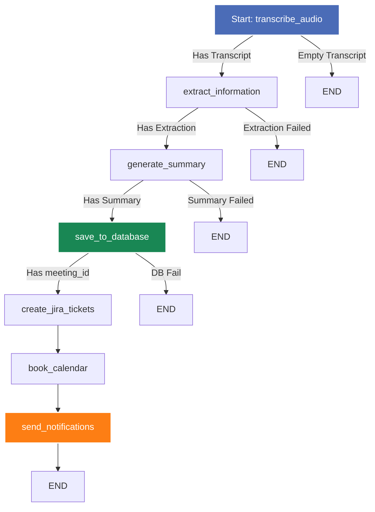

# Meeting Intelligence Agent - Backend Developer Guide

This directory houses the backend codebase for the **Meeting Intelligence Agent**, a FastAPI-powered service integrated with LangGraph for processing meeting audio recordings. It transcribes audio, extracts structured intelligence (action items, decisions, participants, and topics), persists data to Neon Postgres, and dispatches results to third-party integrations (Jira, Google Calendar, Slack, and SendGrid).

---

## Table of Contents

1. [Architecture & Design Concepts](#architecture--design-concepts)
2. [LangGraph Agentic Pipeline](#langgraph-agentic-pipeline)
3. [Speaker Diarization & Audio Chunking](#speaker-diarization--audio-chunking)
4. [Database Schema & Job Persistence](#database-schema--job-persistence)
5. [Third-Party Integrations](#third-party-integrations)
6. [FastAPI Web Layer & Routes](#fastapi-web-layer--routes)
7. [Configuration & Environment Setup](#configuration--environment-setup)
8. [Testing & Verification](#testing--verification)
9. [Code Structure](#code-structure)

---

## Architecture & Design Concepts

The backend is built as a modular, production-ready asynchronous Python application using **FastAPI** for HTTP routing, **SQLAlchemy** for database connectivity, and **LangGraph** to coordinate multi-agent processes.

### Key Concepts

*   **Stateful Agent Pipelines**: Instead of monolithic scripts, processing is designed as a directed state graph. Shared state flows through specialized nodes, ensuring clear separation of concerns, easy error recovery, and modular testing.
*   **Asynchronous I/O**: The API endpoints utilize FastAPI's asynchronous support (`async/await`) for database operations, network routing, and streaming files. 
*   **Thread Pools for Synchronous Blocks**: Heavy synchronous libraries (e.g., Jira SDK, Google API clients, PyAnnote pipeline, LangGraph execution) are run in background threads using `asyncio.to_thread` or standard background tasks to avoid blocking FastAPI's main event loop.
*   **Persistent Job State**: Processing status, intermediate node timings, and errors are stored in PostgreSQL (`processing_jobs` table), surviving server restarts and multi-worker deployment environments.
*   **API Resilience**: Outbound LLM and integration requests are protected with exponential backoff and automatic retry policies via the `tenacity` library.

---

## LangGraph Agentic Pipeline

The meeting processing flow is modeled as a state machine using `langgraph.graph.StateGraph`. The state container `AgentState` maps to Pydantic validation schemas.



### Pipeline Node Overview

| Node | Name | LLM / Service | Description | Output |
|---|---|---|---|---|
| **Node 1** | `transcribe_audio` | Groq `whisper-large-v3` + PyAnnote 3.1 + FFmpeg | Validates file, runs optional PyAnnote speaker diarization, handles >25MB FFmpeg chunking, and returns plain & speaker-labelled transcripts. | `transcript`, `diarized_transcript`, `speaker_segments` |
| **Node 2** | `extract_information` | Groq `llama-3.3-70b` | Uses JSON mode to parse action items, decisions, participants, and topics with speaker context. | `extraction` |
| **Node 3** | `generate_summary` | Groq `llama-3.3-70b` | Creates structured title, duration, short summary, and detailed summary. | `summary` |
| **Node 4** | `save_to_database` | SQLAlchemy + Neon Postgres | Persists the meeting, speaker transcripts, action items, decisions, and participants in a single transaction. | `meeting_id` |
| **Node 5** | `create_jira_tickets` | Atlassian Jira SDK | Creates a Jira task per action item using Atlassian Document Format (ADF). | `jira_ticket_ids` |
| **Node 6** | `book_calendar` | Google Calendar API | Books a follow-up meeting via a Google Cloud Service Account. | `calendar_event_id` |
| **Node 7** | `send_notifications` | Slack Webhook + SendGrid | Sends Slack Block Kit cards & personalized emails containing only that recipient's action items. | `notification_results` |

---

## Speaker Diarization & Audio Chunking

### 1. Automatic Audio Chunking (FFmpeg)
Groq's Whisper API imposes a 25MB per-request limit. Node 1 automatically detects if an uploaded file exceeds 25MB and:
1. Invokes FFmpeg's segment muxer with stream-copy (`-c copy`) to split the audio into 10-minute chunks without re-encoding (lossless and fast).
2. Sends each chunk to Whisper independently with full retry logic.
3. Applies time offsets (`i * 600s`) to timestamps before merging transcripts.

### 2. Speaker Diarization (PyAnnote.audio 3.1)
When `HF_TOKEN` is set in `.env` and `pyannote.audio` is installed:
1. Runs `pyannote/speaker-diarization-3.1` on the full audio file to get speaker turn intervals (`SPEAKER_00`, `SPEAKER_01`).
2. Requests Groq Whisper in `verbose_json` mode to obtain timed segment words.
3. Merges segment timestamps with speaker intervals to generate `diarized_transcript`:
   ```
   SPEAKER_00: Hello everyone, let's get started with the standup.
   SPEAKER_01: Sure, I'll share my updates from last week.
   ```
4. If `HF_TOKEN` is missing or pyannote is not installed, transcription gracefully falls back to plain text.

---

## Database Schema & Job Persistence

The database is built on **Neon Serverless Postgres** utilizing `pgvector` for semantic search.

```
  ┌─────────────────────────────────────────────────────────────┐
  │                           meetings                          │
  ├─────────────────────────────────────────────────────────────┤
  │ id (PK) | title | audio_filename | duration_minutes |       │
  │ short_summary | detailed_summary | transcript |             │
  │ diarized_transcript | embedding_status | created_at         │
  └──────────────────────────────┬──────────────────────────────┘
                                 │
         ┌───────────────────────┼──────────────────────────────┬──────────────────────────────┐
         ▼                       ▼                              ▼                              ▼
 ┌───────────────┐       ┌───────────────┐              ┌───────────────┐              ┌───────────────┐
 │ action_items  │       │   decisions   │              │ participants  │              │processing_jobs│
 ├───────────────┤       ├───────────────┤              ├───────────────┤              ├───────────────┤
 │ id (PK)       │       │ id (PK)       │              │ id (PK)       │              │ id (PK)       │
 │ meeting_id(FK)│       │ meeting_id(FK)│              │ meeting_id(FK)│              │ status        │
 │ description   │       │ description   │              │ name          │              │ meeting_id    │
 │ owner         │       │ context       │              │ email (Opt)   │              │ completed_node│
 │ due_date      │       │ created_at    │              │ created_at    │              │ node_timings  │
 │ priority      │       └───────────────┘              └───────────────┘              │ started_at    │
 │ jira_ticket_id│                                                                     │ completed_at  │
 │ status        │                                                                     └───────────────┘
 └───────────────┘
```

---

## Third-Party Integrations

### 1. Jira Ticket Creation ([jira_tool.py](file:///c:/Agentic%20AI%20Project/Backend/tools/jira_tool.py))
*   Converts priority values (`low`, `medium`, `high`) to standard Jira priority strings (`Low`, `Medium`, `High`).
*   Builds rich descriptions compliant with Jira Cloud's **Atlassian Document Format (ADF)**.

### 2. Google Calendar Event Booking ([calender_tool.py](file:///c:/Agentic%20AI%20Project/Backend/tools/calender_tool.py))
*   Connects using Google Cloud Service Account credentials loaded via `GOOGLE_CALENDAR_CREDENTIALS_JSON`.

### 3. Slack Summary Broadcast ([slack_tool.py](file:///c:/Agentic%20AI%20Project/Backend/tools/slack_tool.py))
*   Constructs summary layouts via **Slack Block Kit** (Headers, Dividers, Context, Markdown blocks).

### 4. Transactional Emails ([email_tool.py](file:///c:/Agentic%20AI%20Project/Backend/tools/email_tool.py))
*   Uses **SendGrid API** to send personalized emails so recipients only receive tasks assigned to them.

---

## FastAPI Web Layer & Routes

Defined in [api/routes.py](file:///c:/Agentic%20AI%20Project/Backend/api/routes.py):

*   `GET /health`: Health check & DB verification.
*   `POST /meeting/upload`: Streams incoming audio file to disk.
*   `POST /meetings/process`: Triggers background job processing.
*   `GET /meetings/status/{job_id}`: Retrieves job progress from Postgres `processing_jobs` table.
*   `GET /meetings`: Paginated list of meetings.
*   `GET /meetings/{meeting_id}`: Full meeting details including action items, decisions, participants, and notification logs.
*   `GET /meetings/{meeting_id}/audio`: Streams audio file with `Accept-Ranges: bytes` for frontend player seeking.
*   `PATCH /meetings/{meeting_id}/action-items/{item_id}`: Updates task status (`open`, `in_progress`, `done`).
*   `PATCH /meetings/{meeting_id}/participants/{participant_id}`: Saves participant email.
*   `POST /meetings/{meeting_id}/send/(email|slack|jira|calendar)`: Triggers manual live tool dispatches.
*   `POST /query`: Smart LLM Q&A using Groq Llama 3.3 with full meeting context and keyword fallback.

---

## Configuration & Environment Setup

Settings are managed via a typed `BaseSettings` object in [core/config.py](file:///c:/Agentic%20AI%20Project/Backend/core/config.py) loading from `Backend/.env`.

```bash
# General
APP_ENV=development
SECRET_KEY=generate-a-long-random-string

# LLM Provider (Required)
GROQ_API_KEY=gsk_...

# Database (Required)
DATABASE_URL=postgresql+asyncpg://...
DATABASE_URL_SYNC=postgresql+psycopg2://...

# Speaker Diarization (Optional)
HF_TOKEN=hf_...
DIARIZATION_ENABLED=true

# Audio Chunking
AUDIO_CHUNK_DURATION_SECONDS=600

# Integrations (Optional)
SLACK_WEBHOOK_URL=https://hooks.slack.com/services/...
SENDGRID_API_KEY=SG....
JIRA_URL=https://yourcompany.atlassian.net
JIRA_EMAIL=dev@yourcompany.com
JIRA_API_TOKEN=jira_token_here
GOOGLE_CALENDAR_CREDENTIALS_JSON='{"type": "service_account", ...}'
```

---

## Testing & Verification

Run the complete 71-test Pytest suite (uses in-memory SQLite for speed and isolation):

```bash
cd Backend
python -m pytest tests/ -v
```

Test coverage includes:
- All FastAPI routes & error handlers
- Audio chunking & FFmpeg subprocess handling
- Speaker diarization alignment & fallback
- Groq Llama 3.3 Q&A engine & keyword fallback
- Live tool connectors (mocked)

---

## Code Structure

```
Backend/
├── agents/              # LangGraph Agents
│   ├── transcription.py # Node 1: Whisper + PyAnnote Diarization + FFmpeg Chunking
│   ├── extraction.py    # Node 2: Entity & Information Extraction
│   └── summary.py       # Node 3: Structured Meeting Summarization
├── api/                 # FastAPI Router & App definition
│   ├── main.py          # CORS, GZip, Exceptions, Lifespan entry point
│   └── routes.py        # Request validation, Audio streaming, Q&A agent, Upload stream
├── core/                # System Configuration & Config loaders
│   ├── config.py        # Settings validation (Pydantic Settings)
│   └── logging.py       # Structlog initialization
├── db/                  # Persistence Layer
│   ├── database.py      # SQLAlchemy engine configuration & Node 4 helper
│   └── models.py        # Declarative ORM entities (Meeting, ProcessingJob, etc.)
├── graph/               # LangGraph Engine
│   └── agent_graph.py   # StateGraph flow definitions, routing logic
├── models/              # Schema layer
│   └── schemas.py       # Pydantic state container, API request & response shapes
├── tools/               # Integration Modules
│   ├── calender_tool.py # Node 6: Google Calendar booking
│   ├── diarization_tool.py # PyAnnote 3.1 speaker diarization wrapper
│   ├── email_tool.py    # Node 7a: Personalized SendGrid dispatches
│   ├── jira_tool.py     # Node 5: Jira Issue creation (ADF structured)
│   └── slack_tool.py    # Node 7b: Slack Block Kit Webhook alerts
├── tests/               # Pytest Automated Test Suite
│   ├── conftest.py      # SQLite in-memory fixtures & mock setup
│   ├── test_diarization.py # Diarization unit tests
│   ├── test_routes.py   # API route integration tests
│   └── test_transcription.py # Audio chunking unit tests
├── requirements.txt     # Python Dependencies
└── .env                 # Environment Settings (Git-ignored)
```
