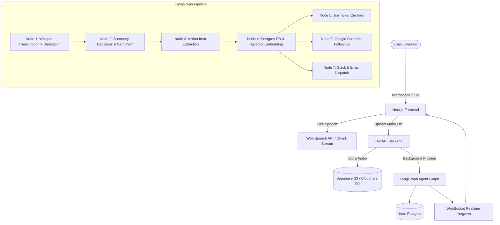

# 🚀 Meeting Intelligence Agent — Updates & Architecture Guide

A comprehensive overview of recent major updates, architectural patterns, and code explanations to help you deeply understand your project.

---

## 📌 Table of Contents
1. [Executive Summary & High-Level Architecture](#1-executive-summary--high-level-architecture)
2. [Major Upgrades Implemented in the Past Few Days](#2-major-upgrades-implemented-in-the-past-few-days)
   - [🎙️ 1. Live Streaming Transcription Feedback](#-1-live-streaming-transcription-feedback)
   - [☁️ 2. Cloud Object Storage (Supabase S3 / Cloudflare R2)](#️-2-cloud-object-storage-supabase-s3--cloudflare-r2)
   - [⏱️ 3. Word-Level Whisper Timestamps & Karaoke Sync Player](#-3-word-level-whisper-timestamps--karaoke-sync-player)
   - [🔗 4. Public Unauthenticated Meeting Share Links](#-4-public-unauthenticated-meeting-share-links)
   - [🚀 5. High Concurrency & Production Scalability](#-5-high-concurrency--production-scalability)
   - [🧱 6. Modular Domain Routers](#-6-modular-domain-routers)
   - [🛡️ 7. Upstash Redis TLS & Rate Limiter Hardening](#️-7-upstash-redis-tls--rate-limiter-hardening)
3. [Deep-Dive Code Walkthrough](#3-deep-dive-code-walkthrough)
   - [The LangGraph Multi-Agent Pipeline (`Backend/graph/agent_graph.py`)](#the-langgraph-multi-agent-pipeline)
   - [Audio Transcription & Diarization (`Backend/agents/transcription.py`)](#audio-transcription--diarization)
   - [Storage Service (`Backend/core/storage.py`)](#storage-service)
   - [Live Speech Streaming Hook (`frontend/lib/hooks/use-live-transcription.ts`)](#live-speech-streaming-hook)
   - [In-Browser Recorder UI (`frontend/components/meeting/live-audio-recorder.tsx`)](#in-browser-recorder-ui)
4. [End-to-End Data Flow](#4-end-to-end-data-flow)
5. [Key Environment Variables Reference](#5-key-environment-variables-reference)

---

## 1. Executive Summary & High-Level Architecture

The **Meeting Intelligence Agent** is an end-to-end AI system that converts spoken meeting audio into structured, actionable business intelligence:
- **Frontend**: Next.js 15 (App Router), React 19, TypeScript, Tailwind CSS, Lucide icons, TanStack Query.
- **Backend**: FastAPI (Python 3.12), LangGraph agent pipeline, SQLAlchemy (AsyncPG), Alembic, Pydantic v2.
- **AI Models**: Groq Whisper Large-v3 (audio transcription), LLaMA 3.3 70B (summarization, action-item extraction, sentiment, topic analysis), Pyannote.audio (optional speaker diarization).
- **Database & Cache**: Neon Serverless Postgres with `pgvector` for semantic RAG memory, Upstash Redis for distributed rate limiting.
- **Object Storage**: S3-compatible cloud storage (Supabase S3 / Cloudflare R2 / AWS S3) with presigned streaming playback.
- **Integrations**: Slack, Jira, Google Calendar, SendGrid Email.



---

## 2. Major Upgrades Implemented in the Past Few Days

### 🎙️ 1. Live Streaming Transcription Feedback
- **Problem**: When users recorded meetings inside the browser using the microphone, they had to wait until the recording ended and uploaded before seeing any text.
- **Solution**: Built a real-time live transcription engine into the in-browser recorder:
  - **Client-side Zero-Latency Stream**: Leverages browser Web Speech API (`SpeechRecognition`) for continuous listening with interim results (0ms latency, words stream as you speak).
  - **Server-side Fallback**: Added `POST /transcribe/live-chunk` in FastAPI backed by Groq Whisper for browsers that lack Web Speech API.
  - **Interactive UI**: Live glassmorphic text box with auto-scroll, glowing status pills, real-time word counter, copy-to-clipboard, and `.txt` transcript download.

### ☁️ 2. Cloud Object Storage (Supabase S3 / Cloudflare R2)
- **Problem**: Audio recordings were saved to Render's local ephemeral filesystem (`/tmp/uploads`). Render free/starter instances restart and redeploy frequently, causing all recorded audio to disappear and audio players to break.
- **Solution**:
  - Implemented `StorageService` (`Backend/core/storage.py`) supporting any S3-compatible cloud object storage.
  - Configured for **Supabase S3 Storage** with path-style addressing (`s3.endpoint_url`), bucket validation, and automatic content-type mapping.
  - Implemented **Presigned URL streaming**: The backend generates temporary signed URLs so clients stream audio directly from cloud CDN with zero server bandwidth load.
  - Seamless fallback: Automatically falls back to local disk storage if cloud credentials are not supplied.

### ⏱️ 3. Word-Level Whisper Timestamps & Karaoke Sync Player
- **Problem**: Transcripts only had block text or coarse paragraph timestamps, making it difficult to follow along with the audio playback.
- **Solution**:
  - Switched Groq Whisper to `verbose_json` requesting word-level timestamps (`timestamp_granularities=["word", "segment"]`).
  - Added mathematical word-distribution synthesis fallback for chunked recordings so word timings are never missing.
  - Mapped speaker diarization turns directly to each individual word: `{ word, start, end, speaker }`.
  - Frontend interactive player: Clicking any word jumps playback directly to that exact second, and active words highlight in real-time like karaoke.

### 🔗 4. Public Unauthenticated Meeting Share Links
- **Problem**: Stakeholders, clients, or team members without an account could not view meeting notes or listen to the recording.
- **Solution**:
  - Created high-entropy cryptographic token generator (`secrets.token_urlsafe(32)`).
  - Added public read-only API endpoint `GET /meetings/public/share/{token}` and frontend route `/share/[token]`.
  - External stakeholders can view executive summaries, action items, key decisions, speaker transcripts, and listen to the audio without logging in.

### 🚀 5. High Concurrency & Production Scalability
- **Problem**: Under concurrent load, the backend suffered from asyncio event loop blocking, database connection exhaustion, and worker timeouts.
- **Solution**:
  - **Gunicorn + Uvicorn + uvloop**: Switched production Docker container to multi-worker Gunicorn with `uvloop` (2x to 4x asyncio performance improvement).
  - **Async Thread-Offloaded Bcrypt**: Hashing passwords with bcrypt is CPU-intensive (~150ms). Running it synchronously blocked the asyncio loop for all concurrent users. Created `hash_password_async` using `run_in_executor` to keep the event loop completely free.
  - **Database Connection Pool Scaling**: Scaled connection pool to `pool_size=10, max_overflow=20, pool_recycle=300` to prevent Neon serverless connection drops.

### 🧱 6. Modular Domain Routers
- **Problem**: `Backend/api/routes.py` grew into a 1500+ line monolithic file with mixed concerns (auth, upload, meetings, analytics, search, chat, dispatch).
- **Solution**: Modularized into distinct domain routers:
  - `api/meetings.py`: Meeting lifecycle, upload, streaming, dispatch.
  - `api/analytics.py`: Dashboard metrics, trends, leaderboards.
  - `api/chat.py`: Multi-turn conversational Q&A and vector search.
  - `api/reminders.py`: Overdue deadlines and reminder triggers.
  - `api/search.py`: Fulltext and semantic search.
  - Backwards-compatibility proxy in `api/routes.py` preserves existing tests.

### 🛡️ 7. Upstash Redis TLS & Rate Limiter Hardening
- **Problem**: In-memory rate limiting counters reset on every restart and were isolated per worker. Connecting to Upstash failed due to missing `redis` dependency and plaintext `redis://` protocol.
- **Solution**:
  - Added `redis>=5.0.0` in `requirements.txt`.
  - Enforced `rediss://` (TLS encrypted protocol) required by Upstash.
  - Added startup health verification (`storage.check()`) with graceful in-memory fallback.

---

## 3. Deep-Dive Code Walkthrough

### The LangGraph Multi-Agent Pipeline
📁 **File**: [Backend/graph/agent_graph.py](file:///c:/Agentic%20AI%20Project/Backend/graph/agent_graph.py)

LangGraph defines state machines where each node is a specialized agent receiving the current `AgentState` and returning state updates.

```python
# graph/agent_graph.py
graph = StateGraph(AgentState)

# 1. Transcribe audio using Whisper Large-v3
graph.add_node("transcribe_audio", transcribe_audio)

# 2. Extract executive summary, key decisions, and sentiment
graph.add_node("summarise_meeting", summarise_meeting)

# 3. Extract actionable items with owners, priorities, and deadlines
graph.add_node("extract_information", extract_information)

# 4. Save results to Postgres and compute vector embeddings
graph.add_node("persist_results", persist_results)

# 5, 6, 7. Dispatch channels (Jira, Google Calendar, Slack, Email)
graph.add_node("create_jira_issue", create_jira_issue)
graph.add_node("schedule_calendar_event", schedule_calendar_event)
graph.add_node("dispatch_notifications", dispatch_notifications)
```
- **Conditional Routing**: If the audio transcript is empty (silent audio), the graph exits immediately to prevent wasting LLM tokens.
- **Observability**: Every node is instrumented with wall-clock timing in milliseconds (`node_timings`) and pushes real-time WebSocket events to the frontend.

---

### Audio Transcription & Diarization
📁 **File**: [Backend/agents/transcription.py](file:///c:/Agentic%20AI%20Project/Backend/agents/transcription.py)

1. **Automatic Audio Chunking**: Groq Whisper has a 25 MB per-request file size limit. If an uploaded meeting is larger (e.g. 100 MB), `_split_audio_with_ffmpeg` slices the audio into 10-minute segments using FFmpeg's `-vn -c:a libmp3lame -b:a 64k` stream re-encoder, transcribes each slice, and joins them seamlessly.
2. **Word Timestamps**:
   ```python
   response = client.audio.transcriptions.create(
       model="whisper-large-v3",
       file=audio_file,
       response_format="verbose_json",
       timestamp_granularities=["word", "segment"],
       language="en",
   )
   ```
3. **Live Chunk Transcription**:
   `transcribe_audio_chunk(audio_bytes, filename, prompt)` takes short 1-5 second audio slices from the browser recorder, passes them to Groq Whisper with a prompt continuation context, and returns real-time text.

---

### Storage Service
📁 **File**: [Backend/core/storage.py](file:///c:/Agentic%20AI%20Project/Backend/core/storage.py)

A unified abstraction for cloud and local storage:
```python
class StorageService:
    def upload_file(self, local_path: Path, object_name: str) -> str:
        # Uploads to Supabase / Cloudflare R2 / S3 with retry logic
        ...
    def generate_presigned_url(self, object_name: str, expiration: int = 3600) -> str:
        # Generates an S3 presigned URL for direct secure streaming
        ...
```
- **Bucket Path-Style Addressing**: Configured `s3={'addressing_style': 'path'}` to ensure compatibility with Supabase S3 endpoints (`https://<id>.supabase.co/storage/v1/s3`).

---

### Live Speech Streaming Hook
📁 **File**: [frontend/lib/hooks/use-live-transcription.ts](file:///c:/Agentic%20AI%20Project/frontend/lib/hooks/use-live-transcription.ts)

A React hook providing speech-to-text during microphone recording:
- **SpeechRecognition Lifecycle**:
  - `continuous = true`: Keeps listening even when the speaker pauses.
  - `interimResults = true`: Emits raw hypotheses in real time before finalizing words.
  - `onend` auto-restart: If the browser stops recognition during silence while the user is still recording, the hook immediately re-attaches without dropping state.
- **Server-Stream Fallback**: If `window.SpeechRecognition` is undefined (Firefox, Linux browsers), it automatically routes recorded audio slices to the FastAPI backend Whisper endpoint.

---

### In-Browser Recorder UI
📁 **File**: [frontend/components/meeting/live-audio-recorder.tsx](file:///c:/Agentic%20AI%20Project/frontend/components/meeting/live-audio-recorder.tsx)

- **AudioContext & AnalyserNode**: Reads raw audio frequencies from `navigator.mediaDevices.getUserMedia()` to draw a dynamic 60fps waveform on an HTML5 `<canvas>`.
- **Integrated Live Stream Viewport**:
  - Displays finalized sentences in crisp text.
  - Displays currently spoken interim words in italic accent color with an animated pulsing cursor (`|`).
  - Auto-scrolls so new words are always visible.
  - Provides instant "Copy Transcript" and "Download .txt" buttons.

---

## 4. End-to-End Data Flow

```
[1. User speaks into microphone]
        │
        ├──> Web Speech API (Browser) ──> Real-time text in UI (0ms latency)
        └──> MediaRecorder (Opus WebM) ──> Accumulated audio buffer
                    │
                    ▼
[2. User stops & clicks "Process Meeting Audio"]
        │
        ▼
[3. Upload to Backend (POST /meeting/upload)]
        │
        ├──> Persist in Supabase S3 (StorageService)
        └──> Queue LangGraph background processing job
                    │
                    ▼
[4. LangGraph Multi-Agent Pipeline Runs]
        ├── Node 1: Whisper Large-v3 ──> Transcript + word timestamps + speakers
        ├── Node 2: LLaMA 3.3 70B ─────> Executive summary, decisions, sentiment
        ├── Node 3: LLaMA 3.3 70B ─────> Action items (owners, deadlines, priorities)
        ├── Node 4: Neon Postgres ─────> Save meeting, action items, pgvector embeddings
        └── Nodes 5-7: Dispatch ───────> Jira tickets, Calendar event, Slack/Email
                    │
                    ▼
[5. Real-Time WebSocket Updates (ws://.../meetings/ws/{job_id})]
        │
        ▼
[6. Dashboard & Interactive Meeting View]
        ├── Karaoke audio player synchronized with word timestamps
        ├── Action item Kanban / status toggles
        ├── Interactive RAG Chat agent with meeting memory
        └── Shareable public link for external stakeholders
```

---

## 5. Key Environment Variables Reference

| Environment Variable | Description |
|---|---|
| `GROQ_API_KEY` | Powers Whisper Large-v3 transcription and LLaMA 3.3 LLM nodes. |
| `DATABASE_URL` | Neon Postgres async connection string (`postgresql+asyncpg://...`). |
| `DATABASE_URL_SYNC` | Neon Postgres sync connection string for Alembic migrations. |
| `UPSTASH_REDIS_REST_URL` | Upstash Redis URL for distributed rate limiting. |
| `UPSTASH_REDIS_REST_TOKEN` | Upstash Redis security token. |
| `S3_ENDPOINT_URL` | Cloud object storage endpoint (e.g. Supabase S3 or Cloudflare R2). |
| `S3_ACCESS_KEY_ID` | Cloud object storage access key ID. |
| `S3_SECRET_ACCESS_KEY` | Cloud object storage secret access key. |
| `S3_BUCKET_NAME` | S3 bucket name (e.g. `meeting-recordings`). |
| `S3_REGION` | S3 region (default: `auto` or `us-east-1`). |
| `JWT_SECRET_KEY` | Secret key for signing authentication tokens. |
| `SLACK_WEBHOOK_URL` | Optional: Incoming webhook for team Slack notifications. |
| `JIRA_API_TOKEN` | Optional: Atlassian API token for automated Jira ticket creation. |
| `SENDGRID_API_KEY` | Optional: SendGrid key for meeting participant emails. |
| `GOOGLE_CALENDAR_CREDENTIALS` | Optional: OAuth service account credentials for Google Calendar. |

---

*Document created on October 3, 2026 for ultronop592/Meeting-Intelligence-Agent.*
