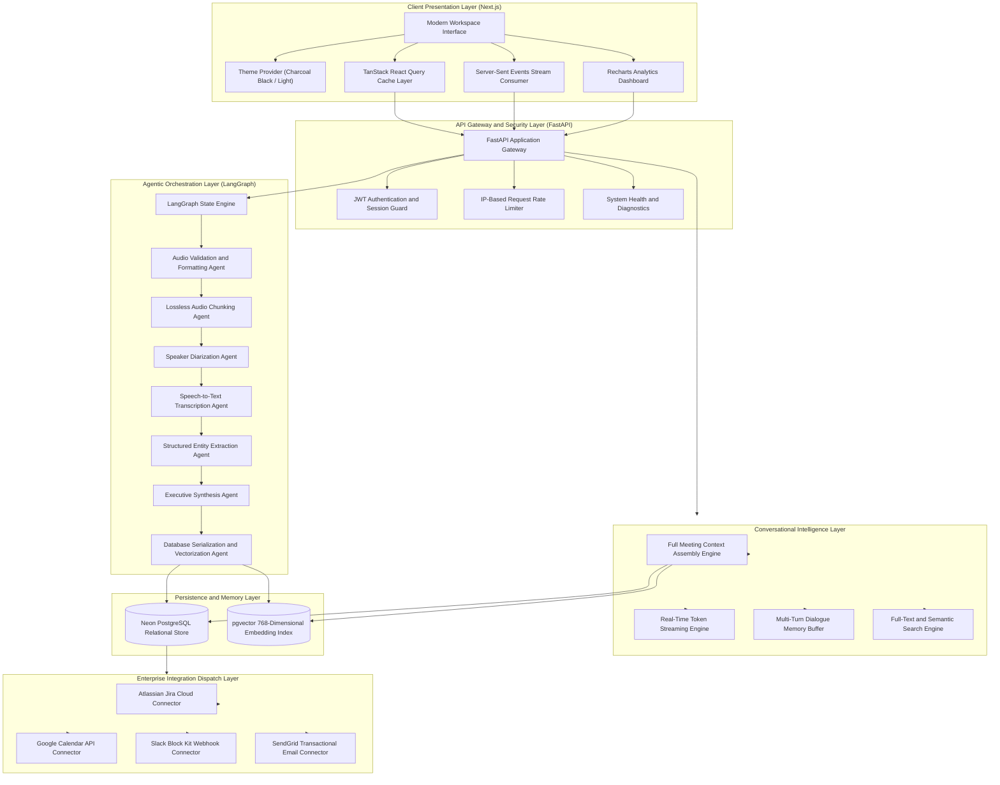
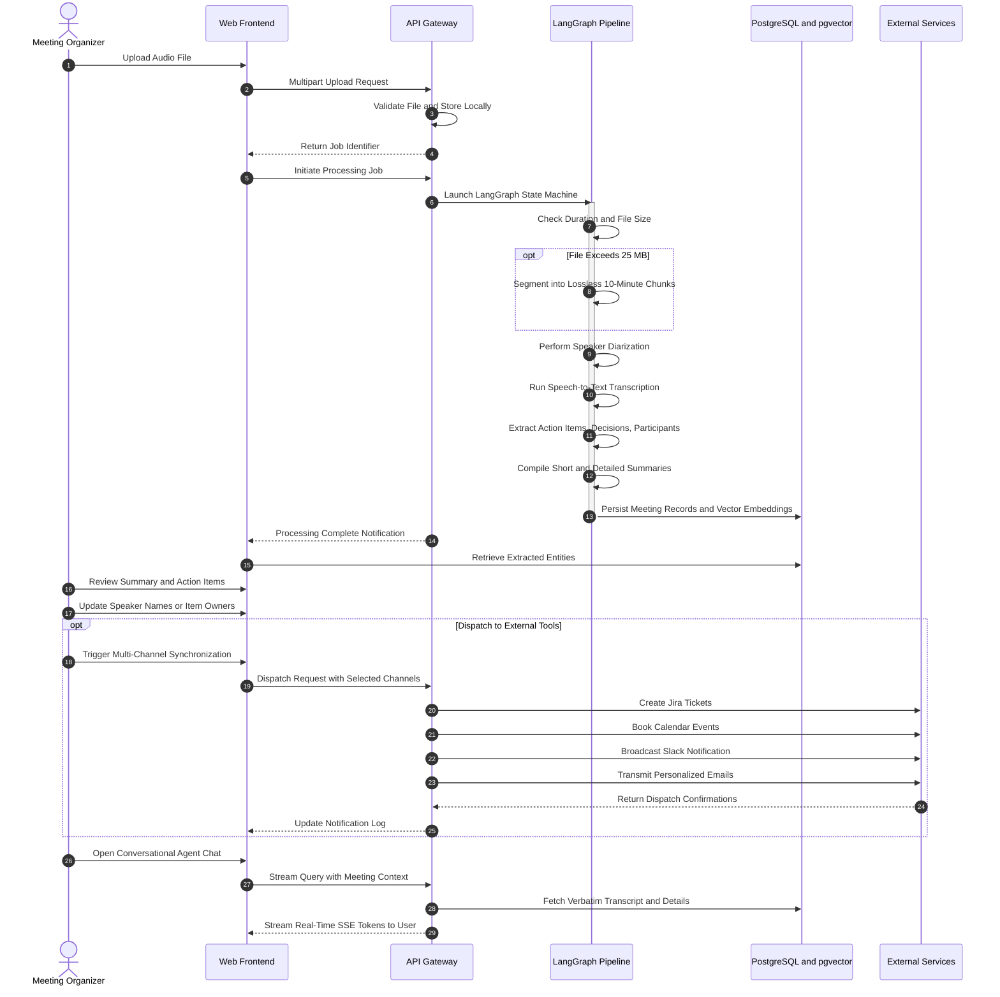

# Meeting Intelligence Agent

Enterprise AI Meeting Intelligence and Workflow Automation Platform

The Meeting Intelligence Agent is an enterprise-grade artificial intelligence platform designed to ingest meeting audio and video recordings of any duration, process them through an agentic multi-stage pipeline, extract structured intelligence, index records into a persistent vector memory layer, generate cross-meeting analytical insights, and synchronize deliverables across workplace communication and productivity tools.

---

## Executive Summary

Modern organizations spend countless hours in discussions where critical decisions, commitments, and deadlines are voiced but frequently lost in unorganized notes. The Meeting Intelligence Agent resolves this by serving as an autonomous intelligence layer over company conversations.

The platform provides end-to-end automation from the moment an audio recording is uploaded to the final execution of follow-up tasks:

* Ingests multimedia recordings of arbitrary size and format, applying automated segmentation when files exceed processing limits.
* Resolves speaker identities through acoustic diarization, attributing spoken dialogue to specific contributors.
* Transcribes audio using high-accuracy speech models and extracts structured data entities including action items, owners, deadlines, priority levels, and formal decisions with contextual rationale.
* Synthesizes executive summaries and comprehensive meeting minutes.
* Generates dense vector representations for cross-meeting semantic search and longitudinal analysis.
* Incorporates a human-in-the-loop review workflow, allowing project leaders to inspect and edit extracted items before initiating external synchronizations.
* Dispatches approved deliverables selectively to Atlassian Jira Cloud, Google Calendar, Slack channels, and SendGrid email notifications.
* Provides a real-time conversational agent capable of answering complex inquiries across single meetings or the entire workspace repository using streaming responses backed by full verbatim transcripts and structured metadata.
* Displays aggregate metrics and longitudinal trends through an interactive analytics dashboard with a charcoal black theme.

---

## System Architecture

The platform is architected around a decoupled, micro-layered framework comprising a Next.js client interface, a FastAPI application server, a LangGraph agentic workflow engine, and a Neon PostgreSQL database with vector capabilities.

---

## End-to-End Processing Workflow

The operational lifecycle of a meeting recording proceeds through eight distinct phases, ensuring data integrity, acoustic accuracy, extraction fidelity, and human oversight.

---

## Core Functional Modules

### 1. Audio Ingestion and Adaptive Chunking

The ingestion system accepts recordings in diverse audio and video formats, including MP3, WAV, M4A, FLAC, OGG, WEBM, and MP4.

When audio recordings exceed standard processing constraints, the pipeline activates an adaptive segmentation routine. Utilizing stream-copy muxing, the file is divided into consecutive segments of uniform duration without re-encoding, preserving original acoustic fidelity while circumventing payload limitations. The resulting chunks are processed sequentially, and their timestamped transcripts are consolidated into a unified dialogue stream.

### 2. Speaker Diarization and Identity Resolution

Acoustic diarization analyzes spectral features to detect speech activity and distinguish individual voices.

* Spoken segments are tagged with distinct speaker identifiers along with precise start and end millisecond timestamps.
* Dialogue lines are organized sequentially to reflect the natural conversational flow.
* The web interface includes a Speaker Resolution tool that enables users to map raw labels to actual team member identities, automatically rewriting the stored transcript with clean speaker attribution.

### 3. Structured Intelligence Extraction

Rather than treating meeting transcripts as unstructured prose, specialized extraction nodes parse the conversation into typed entities:

* Action Items: Specific tasks extracted with descriptive titles, designated owners, deadlines, priority levels (High, Medium, Low), and current status (Open, In Progress, Done).
* Key Decisions: Crucial technical, operational, or business agreements captured alongside their contextual rationale.
* Meeting Participants: Comprehensive list of active contributors detected during the discussion, with editable contact email addresses for automated notifications.

### 4. Executive Summarization

The summarization module generates two complementary tiers of meeting synthesis:

* Executive Overview: A concise, high-level synopsis highlighting key outcomes, blockers, and primary objectives for executive leadership.
* Detailed Minutes: A comprehensive, thematic breakdown covering detailed discussion threads, alternatives considered, technical justifications, and planned next steps.

### 5. Persistent Storage and Vector Memory

Processed records are committed to a serverless PostgreSQL database running in the cloud with vector extension support.

* Relational integrity is enforced across users, meetings, action items, decisions, participants, and notification logs.
* Normalized dense vector representations are generated for meeting content and stored in an indexed vector column.
* Vector similarity search enables retrieval of related historical discussions, supporting semantic search and longitudinal inquiries.

### 6. Human-in-the-Loop Governance and Multi-Channel Dispatch

To prevent erroneous automated dispatches, the platform enforces a human-in-the-loop review mechanism:

* After processing, the pipeline pauses external synchronizations and presents the extracted deliverables to the organizer.
* The organizer can edit action item descriptions, reassign owners, adjust due dates, update participant emails, and remove non-essential items.
* Once verified, the organizer selectively initiates dispatch to any combination of connected services:
  * Atlassian Jira Cloud: Generates structured issue tickets formatted in Atlassian Document Format with assigned owners, priority mappings, and deadlines.
  * Google Calendar: Schedules follow-up review sessions via service account authorization, adding meeting details and participant invites.
  * Slack: Posts rich notification cards formatted with Block Kit components, displaying summaries, top decisions, and pending action items.
  * SendGrid Email: Transmits individualized email summaries ensuring participants receive their assigned tasks directly in their inbox.

### 7. Conversational Intelligence Agent

The platform features an interactive intelligence chatbot accessible from any page:

* Whole-Context Awareness: Unlike conventional chatbot architectures that truncate inputs to small context windows, the agent assembles the comprehensive meeting dossier—including up to sixty thousand characters of verbatim diarized transcript, detailed minutes, action items with owners and deadlines, and decision records.
* Real-Time Token Streaming: Responses are streamed back via Server-Sent Events (SSE), delivering immediate progressive text rendering with dynamic typing indicators.
* Context Scope Switching: Users can toggle between scoping queries to a specific meeting or searching across all workspace records.
* Multi-Turn Conversational Memory: Maintains preceding conversational exchanges, enabling iterative drill-downs, clarifying questions, and contextual follow-ups.
* Rich Text Rendering: Structured responses format headers, bullet points, numbered lists, and code blocks cleanly, complete with citation badges and one-click clipboard copying.

### 8. Cross-Meeting Analytics Engine

The analytics dashboard aggregates historical meeting data to deliver actionable insights into organizational productivity:

* Executive Productivity Metrics: Tracks total meetings recorded, cumulative discussion hours, total action items generated, overall task completion rate, and comparative seven-day versus thirty-day trends.
* Meeting and Action Item Velocity: Visualizes weekly and monthly meeting frequencies against completed action items over time.
* Participant Contribution Distribution: Quantifies attendance volume and assigned action item burdens across team members to highlight workload imbalances.
* Task Status Allocation: Displays real-time distributions of open, in-progress, completed, and overdue commitments.
* Recurring Discussion Topics: Extracts and ranks prominent discussion keywords and themes across all recorded sessions.

---

## User Interface Design and Experience

The frontend is constructed using modern web design principles to provide an executive-level visual experience:

* Charcoal Black Dark Mode: A bespoke dark theme engineered with deep charcoal canvas tones, matte surface cards, subtle borders, and warm amber accents, providing optimal contrast and reduced eye strain during extended analysis.
* Editorial Light Mode: A crisp, warm-toned light theme utilizing clean typography and refined surface styling.
* Instant Theme Switcher: A prominent, accessible switch button in the navigation header that toggles between Charcoal Black and Light mode with immediate rendering and local storage persistence.
* Zero Flash of Unstyled Theme: Early initialization scripts ensure the interface renders with the user's preferred theme without visual flickering during initial page load.
* Interactive Audio Player: Native audio playback interface featuring scrubbing, variable speed control from 0.75x to 2.0x, and synchronized transcript highlighting.
* Global Intelligence Search: Unified search modal offering full-text search and semantic vector discovery across meetings, decisions, and tasks.

---

## Data Models and Relational Schema

The platform organizes information across seven interconnected database entities:

| Entity Name | Primary Key | Foreign Keys | Key Attributes | Functional Role |
|---|---|---|---|---|
| Users | Identifier | None | Email, Hashed Password, Full Name, Created Timestamp | Authentication, authorization, and data isolation |
| Meetings | Identifier | User Identifier | Title, Audio Filename, Duration Minutes, Short Summary, Detailed Summary, Raw Transcript, Diarized Transcript, Vector Embedding, Embedding Status, Created Timestamp | Core meeting record storing transcripts and vector representations |
| Action Items | Identifier | Meeting Identifier | Description, Owner, Due Date, Priority, Jira Ticket Identifier, Status, Created Timestamp | Trackable deliverables with workflow statuses and external ticket linkages |
| Decisions | Identifier | Meeting Identifier | Description, Contextual Rationale, Created Timestamp | Formal agreements and organizational decisions recorded during discussions |
| Participants | Identifier | Meeting Identifier | Contributor Name, Email Address, Speaker Label, Created Timestamp | Contributor records linking acoustic speaker profiles to contact details |
| Notifications Log | Identifier | Meeting Identifier | Channel Type, Delivery Status, Detailed Payload, Created Timestamp | Audit trail of external integration dispatches |
| Processing Jobs | Identifier | User Identifier, Meeting Identifier | Job Status, Completed Pipeline Nodes, Node Execution Timings, Started Timestamp, Completed Timestamp | State tracking for asynchronous background pipeline executions |

---

## System Configuration Specifications

The platform is configured via environment variables organized by functional layer.

### Application and Security Settings

| Variable Name | Description | Default / Format | Required |
|---|---|---|---|
| APP_ENV | Runtime environment stage | development / production | Yes |
| SECRET_KEY | Cryptographic secret for signing JWT tokens | Alphanumeric secret string | Yes |
| ACCESS_TOKEN_EXPIRE_MINUTES | Lifetime duration of issued JWT authentication tokens | Integer representing minutes | No |

### Database and Vector Storage Settings

| Variable Name | Description | Default / Format | Required |
|---|---|---|---|
| DATABASE_URL | Asynchronous PostgreSQL connection string with vector support | postgresql+asyncpg connection URI | Yes |
| DATABASE_URL_SYNC | Synchronous PostgreSQL connection string for administrative migrations | postgresql+psycopg2 connection URI | Yes |

### Speech, Diarization, and Inference Settings

| Variable Name | Description | Default / Format | Required |
|---|---|---|---|
| OPERNROUTER_API_KEY | API access key for conversational intelligence and summarization | Secret key string | Yes |
| OPENROUTER_MODEL | Primary language model identifier for reasoning and chat | Standard model identifier | No |
| GROQ_API_KEY | API key for high-speed speech transcription and language processing | Secret key string | Yes |
| HF_TOKEN | HuggingFace user access token for acoustic diarization model weights | User access token | No |
| DIARIZATION_ENABLED | Toggle enabling or bypassing speaker diarization during pipeline runs | Boolean string | No |

### Enterprise Integration Settings

| Variable Name | Description | Default / Format | Required |
|---|---|---|---|
| JIRA_URL | Base URL of the Atlassian Jira Cloud instance | Fully qualified URL | No |
| JIRA_EMAIL | Account email associated with the Jira API token | Valid email address | No |
| JIRA_API_TOKEN | API authentication token generated in Atlassian account | Secret token string | No |
| JIRA_PROJECT_KEY | Target Jira project key for created issues | Short uppercase identifier | No |
| GOOGLE_CALENDAR_ID | Target Google Calendar identifier for scheduled follow-ups | Email or calendar identifier | No |
| GOOGLE_CALENDAR_CREDENTIALS_JSON | Google Cloud Service Account JSON credentials | Serialized JSON string | No |
| SLACK_WEBHOOK_URL | Incoming webhook URL for posting messages to Slack channels | HTTPS webhook URL | No |
| SENDER_EMAIL | Verified sender address for outbound transactional emails | Valid email address | No |
| SENDGRID_API_KEY | API key for authenticating with the SendGrid delivery service | Secret key string | No |

### Client Settings

| Variable Name | Description | Default / Format | Required |
|---|---|---|---|
| NEXT_PUBLIC_API_BASE_URL | Base URL connecting the frontend client to the backend API gateway | Fully qualified URL | Yes |

---

## Quality Assurance and Verification

The platform maintains a multi-faceted testing and verification regimen:

* Backend Test Suite: Comprehensive unit and integration test coverage across authentication, authorization guards, meeting data operations, analytical aggregation endpoints, vector similarity search, and Server-Sent Events streaming routes.
* Frontend Static Analysis and Type Verification: Full TypeScript compilation checking ensuring strict contract compliance across all API schemas, client state hooks, and visual components.
* End-to-End Streaming Validation: Automated test scripts verifying real-time token stream reception, SSE header compliance, and context injection fidelity against live database records.
* Diagnostic Health Checks: Detailed health endpoint evaluating database connectivity, speech model availability, and external service configuration states.

---

## Security and Compliance Architecture

* Strict Data Isolation: All meeting records, transcripts, action items, analytics, and vector embeddings are tied directly to authenticated user accounts, ensuring multi-tenant isolation.
* Password Protection: Passwords are encrypted using salted bcrypt hashing before persistence; raw credentials are never logged or stored.
* Rate Limiting: IP-based sliding-window rate limiters prevent API abuse and brute-force attempts on public endpoints.
* Token Verification: Stateless JSON Web Tokens validate user identity on every protected route with automatic expiration handling.
* Input Validation: Inbound network payloads are validated using strict Pydantic models on the backend and Zod schemas on the frontend.
